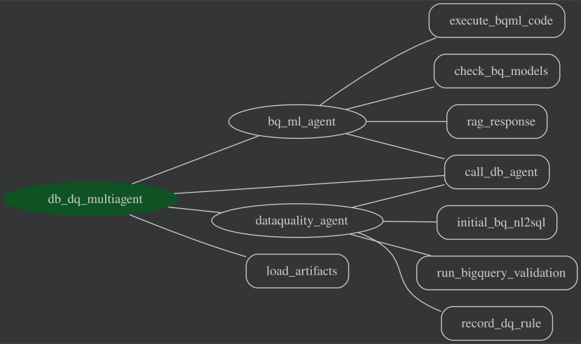

# Data Science with Multiple Agents

## Overview

This project demonstrates a multi-agent system designed for sophisticated data quality. It integrates several specialized agents from data retrieval to data governance and machine learning. The system is built to interact with BigQuery, perform complex data manipulations, generate data quality rules and execute machine learning tasks using BigQuery ML (BQML).


## Agent Details
The key features of the Data Quality Multi-Agent include:

| Feature | Description |
| --- | --- |
| **Interaction Type:** | Conversational |
| **Complexity:**  | Advanced |
| **Agent Type:**  | Multi Agent |
| **Components:**  | Tools, AgentTools, Session Memory, RAG |
| **Vertical:**  | All (Applicable across industries needing advanced data analysis and data quality) |


### Architecture



### Key Features

*   **Multi-Agent Architecture:** Utilizes a top-level agent that orchestrates sub-agents, each specialized in a specific task.
*   **Database Interaction (NL2SQL):** Employs a Database Agent to interact with BigQuery using natural language queries, translating them into SQL.
*   **Data Quality Rule Generation (NL2SQL):** Includes a Data Science Agent that performs data analysis and visualization using Python, based on natural language instructions.
*   **Machine Learning (BQML):** Features a BQML Agent that leverages BigQuery ML for training and evaluating machine learning models.
*   **Code Interpreter Integration:** Supports the use of a Code Interpreter extension in Vertex AI for executing Python code, enabling complex data analysis and manipulation.
*   **ADK Web GUI:** Offers a user-friendly GUI interface for interacting with the agents.
*   **Testability:** Includes a comprehensive test suite for ensuring the reliability of the agents.


## Setup and Installation

### Prerequisites

*   **Google Cloud Account:** You need a Google Cloud account with BigQuery enabled.
*   **Python 3.9+:** Ensure you have Python 3.9 or a later version installed.
*   **Poetry:** Install Poetry by following the instructions on the official Poetry website: [https://python-poetry.org/docs/](https://python-poetry.org/docs/)
*   **Git:** Ensure you have git installed. If not, you can download it from [https://git-scm.com/](https://git-scm.com/) and follow the [installation guide](https://git-scm.com/book/en/v2/Getting-Started-Installing-Git).


### Project Setup with Poetry

1.  **Clone the Repository:**

    ```bash
    git clone https://pso-dev-whaite-790757022693-git.us-central1.sourcemanager.dev/pso-dev-whaite/data_quality_agent.git
    cd data_quality_agent/
    ```

2.  **Install Dependencies with Poetry:**

    ```bash
    poetry install
    ```

    This command reads the `pyproject.toml` file and installs all the necessary dependencies into a virtual environment managed by Poetry.

3.  **Activate the Poetry Shell:**

    ```bash
    poetry env activate
    ```

    This activates the virtual environment, allowing you to run commands within the project's environment.
    Make sure the environment is active. If the above command did not activate the environment for you, it should output a command with a file path similar to:
    ```bash
    source /Users/.../pypoetry/virtualenvs/data-science-Mv02qaT3-py3.12/bin/activate
    ```
    Run the below command using the path outputted above and it should activate the virtual environment for you.

    ```bash
    source /Users/.../pypoetry/virtualenvs/data-science-Mv02qaT3-py3.12/bin/activate activate
    ```

    If the above command did not activate the environment for you, you can also activate it through
     ```bash
    source .venv/bin/activate
    ```

4.  **Check Environment Variables:**
    Navigate to the `.env` file and you should not have to edit any values. Double check that it is in pso-dev-whaite and you have access to this project via GCP console.
    ```bash
    # Vertex backend config
    GOOGLE_CLOUD_PROJECT='pso-dev-ayala'
    GOOGLE_CLOUD_LOCATION='us-central1'
    ```

    Follow the following steps to set up the remaining environment variables.

5.  **BigQuery Setup [Optional]:**
    These steps will load the sample data provided in this repository to BigQuery.
    For our sample use case, we are working on the Forecasting Sticker Sales data from Kaggle:

    _Walter Reade and Elizabeth Park. Forecasting Sticker Sales. https://kaggle.com/competitions/playground-series-s5e1, 2025. Kaggle._

    * 
        Alternatively, you can set the variables from your terminal:

        ```bash
        export BQ_PROJECT_ID='YOUR-BQ-PROJECT-ID'
        ```

        You can skip the upload steps if you are using your own data. We recommend not adding any production critical datasets to this sample agent.
        If you wish to use the sample data, continue with the next step.

    *   You will find the datasets inside 'dq_framework//utils/data/'.
        Make sure you are still in the working directory (`data_quality_agent/dq_framework`). To load the test and train tables into BigQuery, run the following commands:
        ```bash
        python3 dq_framework/utils/create_bq_table.py
        ```


6.  **BQML Setup:**
    The BQML Agent uses the Vertex AI RAG Engine to query the full BigQuery ML Reference Guide.

    Before running the setup, ensure your project ID is added in .env file: `"GOOGLE_CLOUD_PROJECT"`.
    Leave the corpus name empty in the .env file: `BQML_RAG_CORPUS_NAME = ''`. The corpus name will be added automatically once it's created.

    To set up the RAG Corpus for your project, run the methods `create_RAG_corpus()` and `ingest_files()` in
    `dq_framework/utils/reference_guide_RAG.py` by running the below command from the working directory:

    ```bash
    python3 dq_framework/utils/reference_guide_RAG.py
    ```


7.  **Other Environment Variables:**

    *   `NL2SQL_METHOD`: (Optional) Either `BASELINE` or `CHASE`. Sets the method for SQL Generation. Baseline uses Gemini off-the-shelf, whereas CHASE uses [CHASE-SQL](https://arxiv.org/abs/2410.01943)
    *   `CODE_INTERPRETER_EXTENSION_NAME`: (Optional) The full resource name of
        a pre-existing Code Interpreter extension in Vertex AI. If not provided,
        a new extension will be created. (e.g.,
        `projects/<YOUR_PROJECT_ID>/locations/<YOUR_LOCATION>/extensions/<YOUR_EXTENSION_ID>`).
        Check the logs/terminal for the ID of the newly created Code Interpreter
        Extension and provide the value in your environment variables to avoid
        creating multiple extensions.

    From the terminal:

    ```bash
    export CODE_INTERPRETER_EXTENSION_NAME='projects/<YOUR_PROJECT_ID>/locations/us-central1/extensions/<YOUR_EXTENSION_ID>'
    ```

### MCP Toolbox Setup

1. **Install the server**
In order to use the tools defined in the `tools.yaml` file we must install our MCP Toolbox server. In the `dq_framework` directory. To install Toolbox as a binary:

<!-- {x-release-please-start-version} -->
```sh
# see releases page for other versions
export VERSION=0.5.0
export OS="darwin/arm64" # one of linux/amd64, darwin/arm64, darwin/amd64, or windows/amd64
curl -O https://storage.googleapis.com/genai-toolbox/v$VERSION/$OS/toolbox
chmod +x toolbox
```
2. **Running the server**
Open a separate terminal with the virtual environment activated.
Ensure you're in the directory your `tools.yaml` file is located and run 

```bash
./toolbox --tools-file "tools.yaml"
```

Your MCP Toolbox server is now running!
Navigate back to your original terminal.

## Running the Agent

You can run the agent using the ADK command in your terminal.
from the `data_quality_agent` directory:

1.  Run agent in CLI:

    ```bash
    adk run data_science
    ```

2.  Run agent with ADK Web UI:
    ```bash
    adk web
    ```
    Select the data_science from the dropdown


### Example Agent Interaction

Here's a quick example of how a user might interact with the Data Science Multi-Agent System:

> ´**User:** I'd like to create a data quality rule to track anomalies in my weekly sales data by customer

> **Agent:**  Okay, I can help you with that. To create a data quality rule for tracking anomalies in weekly sales data by customer, I need to perform the following steps:

Extract weekly sales data by customer from the sales.orders table.
Create a data quality rule to detect anomalies in the extracted data.
I will need to call both the `call_db_agent` to get the weekly sales data and the `call_dq_agent` to create the data quality rule.

> **Agent:** Runs `call_db_agent` tool

> **Agent:** Runs `transfer_to_agent` tool


> **Agent:** Okay, I will create a data quality rule to detect anomalies in the weekly sales data by customer.

First, I need to know what type of data quality rule you would like. For example, are you interested in anomalies, formatting, null checks, or unique counts?

> **User:** I'm interested in anomalies.

> **Agent:**  Okay, you want to create a data quality rule to track anomalies in your weekly sales data by customer. I will use the SQL query provided by the database agent to create the data quality rule.

> Here's the SQL query that extracts weekly sales data by customer from the sales.orders table:

> SELECT EXTRACT(WEEK FROM order_date) AS week, customer_id, SUM(total_amount) AS weekly_sales FROM sales.orders GROUP BY 1, 2 ORDER BY 1, 2
Now, I will use the initial_bq_nl2sql tool to generate the SQL for detecting anomalies in the weekly sales data.

> Before I proceed to validate the SQL, please confirm if the generated SQL is correct and if you would like to make any changes.

> **User:** Yes, looks good.

> **Agent:** Runs `run_bigquery_validation` tool.

> **Agent:** Runs `record_dq_rule` tool.

> **Agent:** Successfully recorded the data quality rule to track anomalies in weekly sales data by customer.

## Directory Structure of Agents
Each agent displayed here is organized as follows:

```bash
├── agent-name
│   ├── agent_name/
│   │   ├── shared_libraries/               # Folder contains helper functions for tools
│   │   ├── sub_agents/                     # Folder for each sub agent
│   │   │   │   ├── tools/                  # tools folder for the subagent
│   │   │   │   ├── agent.py                # core logic of the sub agent
│   │   │   │   └── prompt.py               # prompt of the subagent
│   │   │   └── ...                         # More sub-agents    
│   │   ├── __init__.py                     # Initializes the agent
│   │   ├── tools/                          # Contains the code for tools used by the router agent
│   │   ├── agent.py                        # Contains the core logic of the agent
│   │   ├── prompt.py                       # Contains the prompts for the agent
│   ├── deployment/                         # Deployment to Agent Engine
│   ├── eval/                               # Folder containing the evaluation method
│   ├── tests/                              # Folder containing unit tests for tools
│   ├── agent_pattern.png                   # Diagram of the agent pattern
│   ├── .env.example                        # Store agent specific env variables
│   ├── pyproject.toml                      # Project configuration
│   └── README.md                           # Provides an overview of the agent
```
### General Structure

The root of each agent resides in its own directory under `data_quality_agent/`. For example, the `dq_framework` agent is located in `data_quality_agent/dq_framework`.


#### Directory Breakdown

1.  **`agent_name/` (Core Agent Code)**: 
    *   This directory contains the core logic of the agent.
    *   **`shared_libraries/`**: (Optional) Contains code that is shared among multiple sub-agents.
    *   **`sub_agents/`**: Contains the definitions and logic for sub-agents.
        *   Each sub-agent has its own directory (e.g., `critic/`, `reviser/` in `llm-auditor`).
        *   **`tools/`**: Contains any custom tools specific to the sub-agent.
        *   **`agent.py`**: Defines the sub-agent's behavior, including its model, tools, and instructions.
        *   **`prompt.py`**: Contains the prompts used to guide the sub-agent's behavior.
    *   **`__init__.py`**: An initialization file that imports the `agent.py` from the folder for marking the `agent_name` directory as a Python package.
    *   **`tools/`**: Contains any custom tools used by the main agent.
    *   **`agent.py`**: Defines the main agent's behavior, including its sub-agents, model, tools, and instructions.
    *   **`prompt.py`**: Contains the prompts used to guide the main agent's behavior.
    
    Note that the initial folder name is with "-" between words whereas the core logic is stored in the folder with the same agent name but with "_" between words (e.g., `llm_auditor`). This is due to the project structure imposed by poetry.

2.  **`deployment/`**

    *   Contains scripts and files necessary for deploying the agent to a platform like Vertex AI Agent Engine.
    *   The `deploy.py` script is often found here, handling the deployment process.

3.  **`eval/`**

    *   Contains data and scripts for evaluating the agent's performance.
    *   Test data (e.g., `.test.json` files) and evaluation scripts (e.g., `test_eval.py`) are typically located here.

4.  **`tests/`**

    *   Contains unit and integration tests for the agent.
    *   Test files (e.g., `test_agents.py`) are used to verify the agent's functionality.

5.  **`agent_pattern.png`**

    *   A visual diagram illustrating the agent's architecture, including its sub-agents and their interactions.

6.  **`.env.example`**

    *   An example file showing the environment variables required to run the agent.
    *   Users should copy this file to `.env` and fill in their specific values.

7.  **`pyproject.toml`**

    *   Contains project metadata, dependencies, and build system configuration.
    *   Managed by Poetry for dependency management.

8.  **`README.md`**

    *   Provides detailed documentation specific to the agent, including its purpose, setup instructions, usage examples, and customization options.
    
## Running Evaluations


Evaluation tests assess the overall performance and capabilities of the agent in a holistic manner.

**Run Evaluation Tests:**

    ```bash
    poetry run pytest eval
    ```


- This command executes all test files within the `eval/` directory.
- `poetry run` ensures that pytest runs within the project's virtual environment.


## Running Tests

Tests assess the overall executability of the agents.

**Test Categories:**

*   **Integration Tests:** These tests verify that the agents can interact correctly with each other and with external services like BigQuery. They ensure that the root agent can delegate tasks to the appropriate sub-agents and that the sub-agents can perform their intended tasks.
*   **Sub-Agent Functionality Tests:** These tests focus on the specific capabilities of each sub-agent (e.g., Database Agent, BQML Agent). They ensure that each sub-agent can perform its intended tasks, such as executing SQL queries or training BQML models.
*   **Environment Query Tests:** These tests verify that the agent can handle queries that are based on the environment.

**Run Tests:**

    ```bash
    poetry run pytest tests
    ```

- This command executes all test files within the `tests/` directory.
- `poetry run` ensures that pytest runs within the project's virtual environment.


## Deployment on Vertex AI Agent Engine

To deploy the agent to Google Agent Engine, first follow
[these steps](https://cloud.google.com/vertex-ai/generative-ai/docs/agent-engine/set-up)
to set up your Google Cloud project for Agent Engine.

You also need to give BigQuery User and BigQuery Data Viewer permissions to the
Reasoning Engine Service Agent. Run the following commands to grant the required
permissions:

```bash
export RE_SA="service-${GOOGLE_CLOUD_PROJECT_NUMBER}@gcp-sa-aiplatform-re.iam.gserviceaccount.com"
gcloud projects add-iam-policy-binding ${GOOGLE_CLOUD_PROJECT} \
    --member="serviceAccount:${RE_SA}" \
    --condition=None \
    --role="roles/bigquery.user"
gcloud projects add-iam-policy-binding ${GOOGLE_CLOUD_PROJECT} \
    --member="serviceAccount:${RE_SA}" \
    --condition=None \
    --role="roles/bigquery.dataViewer"
```

Next, you need to create a `.whl` file for your agent. From the `data-science`
directory, run this command:

```bash
poetry build --format=wheel --output=deployment
```

This will create a file named `data_science-0.1-py3-none-any.whl` in the
`deployment` directory.

Then run the below command. This will create a staging bucket in your GCP project and deploy the agent to Vertex AI Agent Engine:

```bash
python3 deployment/deploy.py --create
```

When this command returns, if it succeeds it will print an AgentEngine resource
name that looks something like this:
```
projects/************/locations/us-central1/reasoningEngines/7737333693403889664
```
The last sequence of digits is the AgentEngine resource ID.

Once you have successfully deployed your agent, you can interact with it
using the `test_deployment.py` script in the `deployment` directory. Store the
agent's resource ID in an enviroment variable and run the following command:

```bash
export RESOURCE_ID=...
export USER_ID=<any string>
python test_deployment.py --resource_id=$RESOURCE_ID --user_id=$USER_ID
```

The session will look something like this:
```
Found agent with resource ID: ...
Created session for user ID: ...
Type 'quit' to exit.
Input: Hello. What data do you have?
Response: I have access to the train and test tables inside the forecasting_sticker_sales dataset.
...
```

Note that this is *not* a full-featured, production-ready CLI; it is just intended to
show how to use the Agent Engine API to interact with a deployed agent.

The main part of the `test_deployment.py` script is approximately this code:

```python
from vertexai import agent_engines
remote_agent = vertexai.agent_engines.get(RESOURCE_ID)
session = remote_agent.create_session(user_id=USER_ID)
while True:
    user_input = input("Input: ")
    if user_input == "quit":
      break

    for event in remote_agent.stream_query(
        user_id=USER_ID,
        session_id=session["id"],
        message=user_input,
    ):
        parts = event["content"]["parts"]
        for part in parts:
            if "text" in part:
                text_part = part["text"]
                print(f"Response: {text_part}")
```

To delete the agent, run the following command (using the resource ID returned previously):
```bash
python3 deployment/deploy.py --delete --resource_id=RESOURCE_ID
```


## Optimizing and Adjustment Tips

*   **Prompt Engineering:** Refine the prompts for `root_agent`, `bqml_agent`, `db_agent`
    and `ds_agent` to improve accuracy and guide the agents more effectively.
    Experiment with different phrasing and levels of detail.
*   **Extension:** Extend the multi-agent system with your own AgentTools or sub_agents.
    You can do so by adding additional tools and sub_agents to the root agent inside
    `agents/data-science/data_science/agent.py`.
*   **Partial imports:** If you only need certain capabilities inside the multi-agent system,
    e.g. just the data agent, you can import the data_agent as an AgentTool into your own root agent.
*   **Model Selection:** Try different language models for both the top-level
    agent and the sub-agents to find the best performance for your data and
    queries.


## Troubleshooting

*   If you face `500 Internal Server Errors` when running the agent, simply re-run your last command.
    That should fix the issue.
*   If you encounter issues with the code interpreter, review the logs to
    understand the errors. Make sure you're using base-64 encoding for
    files/images if interacting directly with a code interpreter extension
    instead of through the agent's helper functions.
*   If you see errors in the SQL generated, try the following:
    - including clear descriptions in your tables and columns help boost performance
    - if your database is large, try setting up a RAG pipeline for schema linking by storing your table schema details in a vector store